# Active Directory SOC Detection Lab

## Project Overview

I built this lab to practice the detection and investigation workflow used by SOC analysts in a Windows Active Directory environment.

The lab includes a Windows Server domain controller, a domain-joined Windows workstation, Microsoft Sentinel, Windows security logging, Sysmon, PowerShell logging, and a Kali Linux system used to generate controlled attack activity.

Throughout the project, I used KQL to analyze authentication and process events, created custom Microsoft Sentinel detection rules, investigated the resulting incidents, and documented how I determined whether activity was suspicious or expected.

## Objective

The objective of this lab was to build a small enterprise-style Windows environment and practice the day-to-day workflow of a SOC analyst.

I wanted to understand how activity on a Windows endpoint becomes security telemetry, how that telemetry reaches Microsoft Sentinel, and how an analyst can use KQL and detection rules to identify and investigate suspicious behavior.

The main goals of the project were to:

- Build and manage an Active Directory domain
- Configure a domain-joined Windows workstation
- Enable useful Windows, Sysmon, and PowerShell logging
- Send Windows security events to Microsoft Sentinel
- Use KQL to investigate authentication and process activity
- Create custom Sentinel analytics rules
- Generate controlled attack activity using Kali Linux
- Investigate Sentinel incidents and determine whether the activity was malicious or expected
- Document findings using SOC-style incident reports

## Lab Architecture

The lab was built in VirtualBox and designed to represent a small enterprise environment with centralized identity, endpoint logging, attack simulation, and SIEM monitoring.

The main systems used in the lab were:

- **DC01** - Windows Server domain controller running Active Directory Domain Services and DNS
- **WS01** - Windows 11 domain-joined workstation used as the monitored endpoint
- **Kali Linux** - Used as a simulated attacker for controlled network reconnaissance and remote authentication testing
- **Microsoft Sentinel** - Used as the SIEM for log collection, KQL analysis, detection rules, and incident investigation
- **Azure Arc** - Connected and represented WS01 as an Azure-managed machine
- **Azure Monitor Agent** - Collected selected Windows Security events from WS01 and sent them to the Log Analytics workspace through a Data Collection Rule

The general data flow of the lab was:

```text
Kali Linux
Simulated Attacker
      |
      v
    WS01 ---------------- DC01
Windows Endpoint      Domain Controller
      |
      | Windows Security Events
      v
Azure Monitor Agent
      |
      v
Log Analytics Workspace
      |
      v
Microsoft Sentinel
      |
      +--> KQL Queries
      +--> Detection Rules
      +--> Alerts / Incidents
      |
      v
SOC Investigation
```

## Technologies Used

| Technology | Purpose in the Lab |
|---|---|
| **Oracle VirtualBox** | Hosted the virtual machines used in the lab |
| **Windows Server** | Hosted the RaeTech.local Active Directory domain and DNS services |
| **Windows 11 Pro** | Served as the domain-joined workstation and monitored endpoint |
| **Active Directory Domain Services** | Managed domain users, groups, computers, and Group Policy |
| **Group Policy** | Applied security and auditing settings to WS01 |
| **Sysmon** | Provided additional endpoint process telemetry |
| **Windows Security Auditing** | Recorded authentication and process creation events |
| **PowerShell Script Block Logging** | Provided visibility into PowerShell activity |
| **Microsoft Defender** | Provided built-in endpoint protection on WS01 |
| **Azure Arc** | Connected the lab workstation to Azure as a managed machine |
| **Azure Monitor Agent** | Collected Windows Security events from WS01 |
| **Data Collection Rules** | Controlled which Windows events were sent to Azure |
| **Log Analytics Workspace** | Stored and allowed querying of collected security telemetry |
| **Microsoft Sentinel** | Provided SIEM detection, alerting, and incident investigation |
| **Kusto Query Language (KQL)** | Used to search and analyze security events |
| **Kali Linux** | Generated controlled reconnaissance and remote authentication activity |
| **Nmap** | Performed network and service reconnaissance against the lab endpoint |
| **SMB / smbclient** | Generated and tested remote Windows authentication activity |

## Active Directory Environment

I started the lab by building a small Windows domain to represent the identity environment of a business.

The domain controller, **DC01**, was configured with Active Directory Domain Services and DNS for the `RaeTech.local` domain. I created organizational units, users, and security groups to give the environment a basic enterprise structure.

A Windows 11 Pro workstation named **WS01** was then joined to the domain. I verified that a domain user could successfully sign in to the workstation using Active Directory credentials.

### Domain Configuration

| Component | Configuration |
|---|---|
| **Domain** | RaeTech.local |
| **Domain Controller** | DC01 |
| **Domain Services** | Active Directory Domain Services, DNS |
| **Domain Workstation** | WS01 |
| **Workstation OS** | Windows 11 Pro |
| **Example Domain User** | RAETECH\mreed |
| **Identity Structure** | Organizational Units, users, and security groups |

### Active Directory OU Structure

I organized the `RaeTech.local` domain into Organizational Units to separate users and systems by function. This gave the lab a more realistic enterprise structure and provided a foundation for applying policies and managing domain objects.

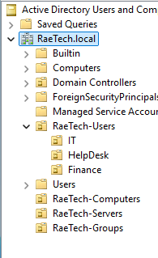

*Active Directory Users and Computers showing the organizational structure created for the RaeTech.local domain.*

### Domain User Login Verification

After joining WS01 to the `RaeTech.local` domain, I verified that a domain user could successfully authenticate to the workstation using Active Directory credentials.

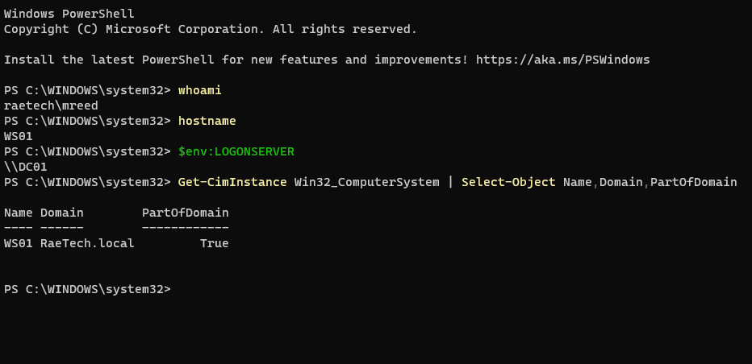

*Successful domain authentication on WS01 using a RaeTech.local user account.*

## Endpoint Security & Logging

After building the domain environment, I configured WS01 to generate security telemetry that could later be analyzed in Microsoft Sentinel.

I enabled process creation auditing, PowerShell Script Block Logging, and Sysmon to provide visibility into authentication activity, commands, and processes running on the workstation.

### Process Creation Auditing

I enabled Windows process creation auditing through Group Policy. This allowed Windows Security Event ID **4688** to record newly created processes and their command-line information.

This became important later when investigating commands such as `net user`, `whoami`, `hostname`, and `ipconfig`.

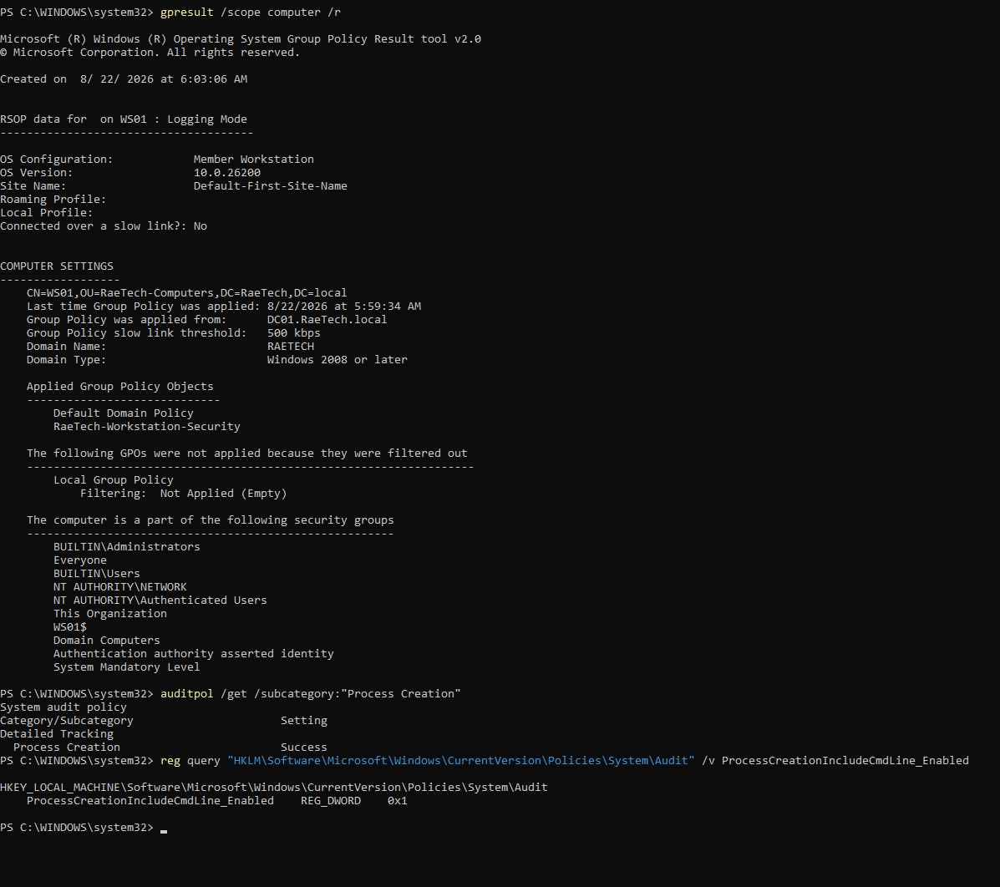

*Group Policy configuration used to enable process creation auditing on WS01.*

### PowerShell Script Block Logging

PowerShell Script Block Logging was enabled to provide additional visibility into PowerShell commands executed on the workstation.

I verified the configuration by confirming PowerShell Event ID **4104** was generated.

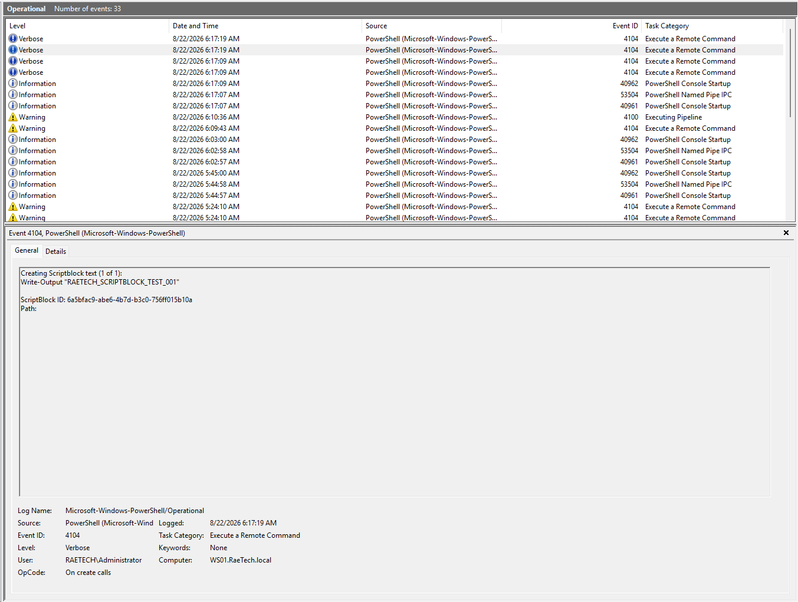

*PowerShell Event ID 4104 confirming Script Block Logging was working.*

### Sysmon

I installed Sysmon on WS01 and applied a custom configuration to increase endpoint visibility beyond the standard Windows Security logs.

Sysmon provided detailed process telemetry that could be used to review process execution and parent-child relationships during an investigation.

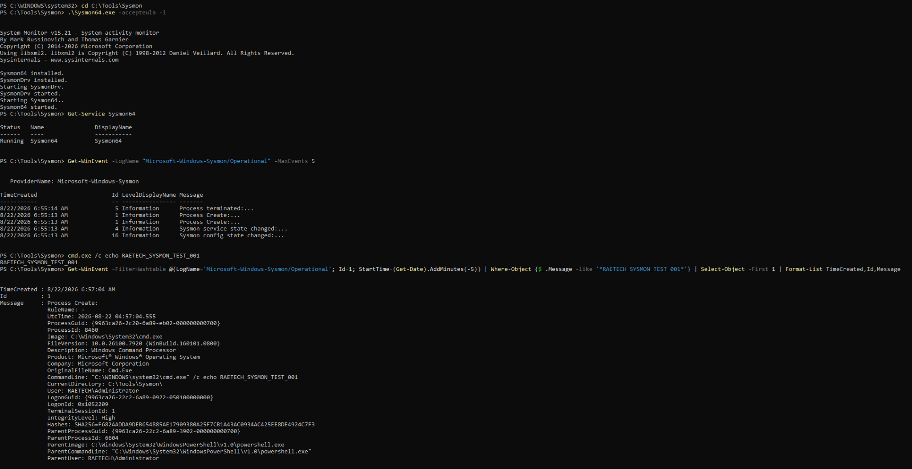

*Sysmon process creation telemetry generated on WS01.*

## Microsoft Sentinel Integration

After configuring security logging on WS01, I connected the workstation to Azure so the Windows Security events could be analyzed in Microsoft Sentinel.

WS01 was onboarded to **Azure Arc** and monitored using the **Azure Monitor Agent**. I created a Data Collection Rule to collect selected Windows Security events and send them to the `RaeTech-Sentinel-Workspace` Log Analytics workspace.

The main Windows Security events collected for this lab included:

- **4624** - Successful logon
- **4625** - Failed logon
- **4688** - Process creation

The telemetry path used in the lab was:

```text
WS01
  |
  | Windows Security Events
  v
Azure Monitor Agent
  |
  | Data Collection Rule
  v
Log Analytics Workspace
  |
  v
Microsoft Sentinel
  |
  +--> KQL Queries
  +--> Analytics Rules
  +--> Alerts / Incidents
```

## Microsoft Sentinel Integration

After configuring security logging on WS01, I onboarded the workstation to Azure Arc and installed the Azure Monitor Agent.

I created a Data Collection Rule to collect selected Windows Security events and send them to the `RaeTech-Sentinel-Workspace` Log Analytics workspace, where Microsoft Sentinel was enabled for detection and investigation.

The primary Windows Security events collected for the lab included:

- **4624** - Successful logon
- **4625** - Failed logon
- **4688** - Process creation

### Security Event Ingestion Verification

I used KQL to verify that Windows Security events from WS01 were successfully reaching the Log Analytics workspace.

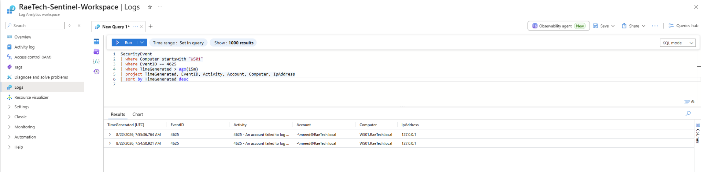

*Windows Event ID 4625 from WS01 successfully ingested and queried in Microsoft Sentinel.*

## Detection Engineering & SOC Investigation

After confirming that Windows telemetry was reaching Microsoft Sentinel, I used KQL to create detection logic for activity that could require SOC investigation.

For each scenario, I generated the activity, verified the Windows events, searched the telemetry with KQL, created a Sentinel analytics rule, and investigated the resulting incident before deciding how it should be classified.

### Detection 1 - Multiple Failed Logons

The first detection monitored repeated failed authentication attempts on WS01 using Windows Security Event ID **4625**.

Repeated login failures in a short period of time can be associated with password guessing or brute-force activity, but failed logons can also happen for legitimate reasons. Because of that, I treated the alert as something that required investigation rather than assuming it was an attack.

The detection logic counted failed authentication attempts against the same account and host:

```kusto
SecurityEvent
| where EventID == 4625
| where Computer startswith "WS01"
| summarize FailedAttempts=count(),
            FirstAttempt=min(TimeGenerated),
            LastAttempt=max(TimeGenerated)
    by Account, Computer
| where FailedAttempts >= 3
```

Microsoft Sentinel generated a **Medium severity** incident after the detection threshold was reached.

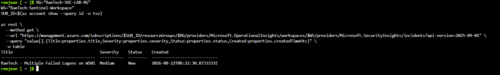

*Microsoft Sentinel incident created after multiple failed authentication events were detected on WS01.*

#### Investigation

I reviewed the authentication timeline and found multiple failed logons followed by successful authentication events for `RAETECH\mreed`.

The successful activity originated from the local workstation and was consistent with cached interactive login and workstation unlock activity. I also reviewed process activity around the same time and did not find obvious suspicious process execution during the reviewed window.

Based on the available evidence and the fact that the activity was intentionally generated as part of the lab, I classified the incident as:

**Benign Positive - Suspicious But Expected**

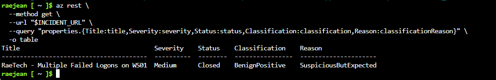

*The incident was closed after the authentication activity was determined to be authorized lab testing.*

**MITRE ATT&CK:** T1110 - Brute Force

### Detection 2 - Account Discovery via `net user`

The second detection focused on Windows account discovery activity.

I generated the activity on WS01 by running:

```cmd
net user
```

Attackers can use this command to identify local accounts on a Windows system after gaining access. Because the same command can also be used legitimately by administrators, I treated the activity as something that required context before determining whether it was malicious.

Windows recorded the activity through process creation events. In Sentinel, I identified both `net.exe` and `net1.exe` running under the `RAETECH\mreed` account.

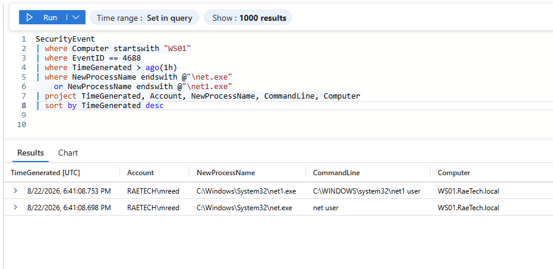

*Microsoft Sentinel process telemetry showing `net.exe` and `net1.exe` executing the account discovery command.*

#### Process Chain Investigation

I reviewed the surrounding process activity to understand how the command was launched.

The process chain showed:

```text
explorer.exe
    |
    v
cmd.exe
    |
    v
net.exe
    |
    v
net1.exe
```

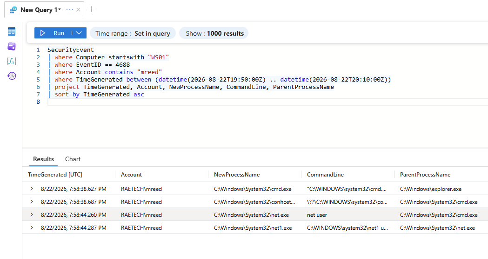

*Process creation events used to reconstruct the execution chain for the `net user` activity.*

The activity originated from an interactive Command Prompt session on WS01. I did not observe obvious additional suspicious process activity in the reviewed time window, and the command was intentionally generated as part of the lab.

I classified the incident as:

**Benign Positive - Suspicious But Expected**

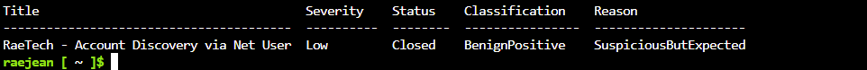

*Account discovery incident closed after the activity was confirmed as authorized lab testing.*

**MITRE ATT&CK:** T1087.001 - Account Discovery: Local Account

### Detection 3 - Windows Discovery Commands

The third detection focused on common Windows discovery commands that can be used to gather information about the current user, hostname, and network configuration.

I generated the activity on WS01 by running:

```cmd
whoami
hostname
ipconfig
```

These commands can be used legitimately by administrators and users, but they are also commonly seen during the discovery stage of an intrusion when an attacker is trying to understand a system they have accessed.

#### Sentinel Investigation

Windows recorded the commands through Event ID **4688** process creation events. I used KQL in Microsoft Sentinel to confirm that the commands were captured under the expected user and workstation.

The query searched for the corresponding Windows processes:

```kusto
SecurityEvent
| where EventID == 4688
| where Computer startswith "WS01"
| where NewProcessName endswith "whoami.exe"
    or NewProcessName endswith "hostname.exe"
    or NewProcessName endswith "ipconfig.exe"
| project TimeGenerated, Account, NewProcessName, CommandLine, ParentProcessName, Computer
| sort by TimeGenerated asc
```

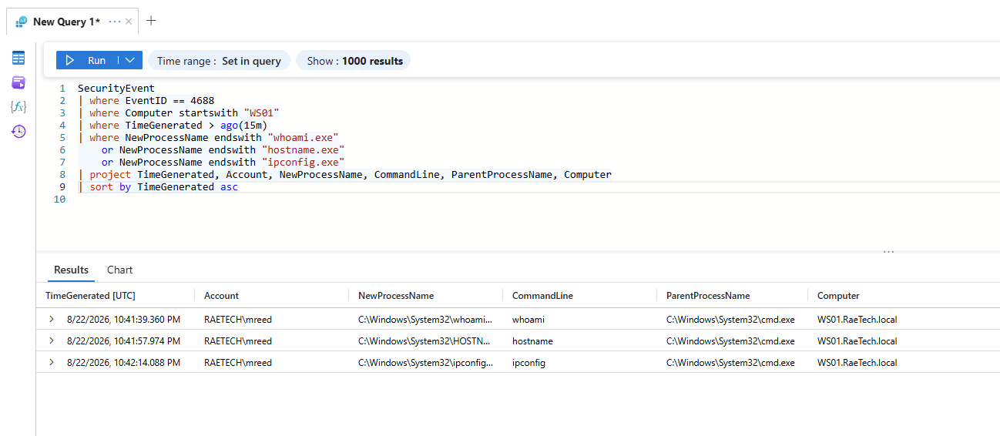

*Microsoft Sentinel showing process creation telemetry for `whoami`, `hostname`, and `ipconfig` on WS01.*

The custom analytics rule generated a **Low severity** incident after the activity matched the detection logic.

I reviewed the user, host, commands, and surrounding process activity. The commands were intentionally executed as part of the RaeTech lab, and I did not identify obvious additional suspicious activity during the reviewed time window.

The incident was classified as:

**Benign Positive - Suspicious But Expected**

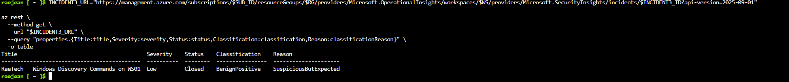

*Windows discovery incident closed after the activity was confirmed as authorized lab testing.*

**MITRE ATT&CK Tactic:** Discovery

- **T1033** - System Owner/User Discovery (`whoami`)
- **T1082** - System Information Discovery (`hostname`)
- **T1016** - System Network Configuration Discovery (`ipconfig`)

## Attack Simulations with Kali Linux

After validating the local Windows detections, I added a Kali Linux VM to the lab to generate activity from a separate system on the network.

Kali used the address `192.168.20.103`, while WS01 used `192.168.20.102`. All testing was performed only against systems inside my own lab.


### Attack 4 - Network Reconnaissance

I used Nmap from the Kali Linux VM to perform a basic network service scan against WS01. The purpose of the test was to simulate the type of reconnaissance an attacker may perform after identifying a Windows system on a network.

The scan identified several exposed Windows services, including:

- **135/TCP** - RPC
- **139/TCP** - NetBIOS
- **445/TCP** - SMB

Windows Filtering Platform blocked many of the connection attempts and generated **Security Event ID 5152**. When I reviewed the events on WS01, I found that the Kali source IP `192.168.20.103` had contacted many different destination ports within only a few seconds.

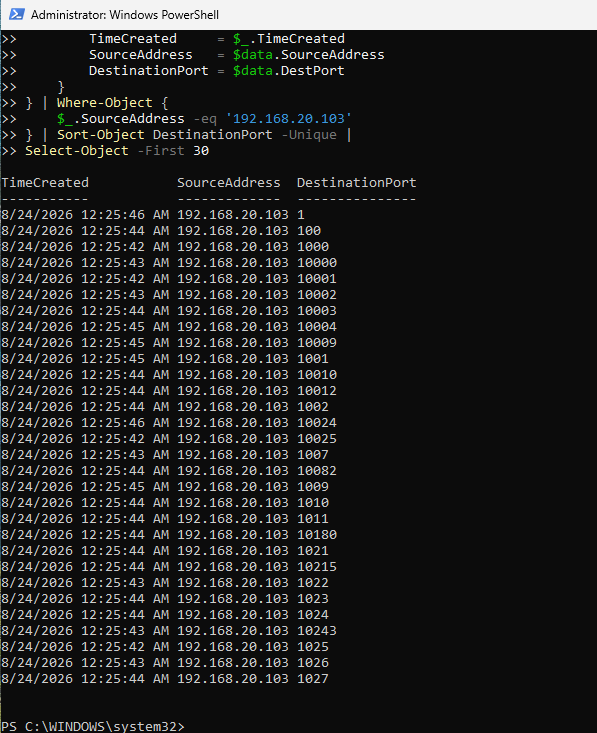

*The Windows Security events showed the same source IP contacting multiple destination ports in a short period of time. This pattern was consistent with the Nmap network service scan.*

Initially, Event ID 5152 was only available locally on WS01. I updated the Azure Data Collection Rule to include Event ID 5152 and verified that the packet-drop events were successfully ingested into Microsoft Sentinel.

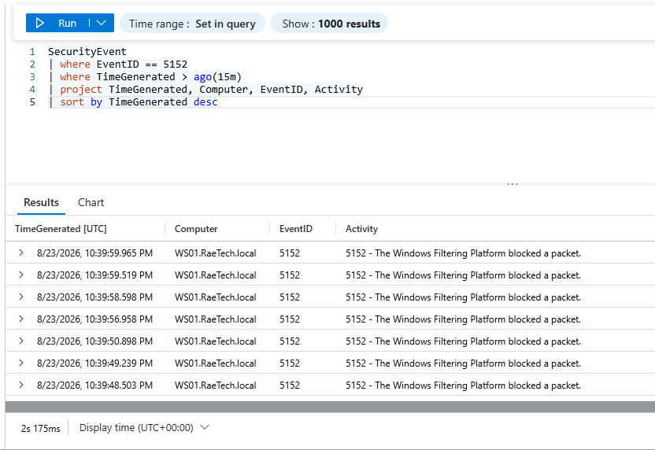

*Event ID 5152 records from WS01 appearing in the Sentinel `SecurityEvent` table confirmed that the network telemetry was successfully reaching the SIEM.*

I then created a Sentinel analytics rule that looked for a single source IP contacting many different destination ports within a short period of time. The activity matched the rule conditions and generated a **Medium severity** network service scanning incident.

During the investigation, I confirmed that the source IP belonged to my Kali Linux lab machine and that the timing matched the authorized Nmap test I performed. The detection itself was valid, but the activity was expected within the lab.

The incident was closed as **Benign Positive - Suspicious But Expected**.

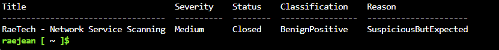

*The Sentinel incident was closed after the source and timing of the activity were confirmed to match the authorized lab test.*

**MITRE ATT&CK:** T1046 - Network Service Scanning

### Attack 5 - Remote SMB Authentication

After identifying SMB on TCP port 445, I used Kali to generate remote authentication activity against WS01 using the dedicated `soclab` test account.

The goal was to observe how Windows records authentication coming from another system on the network and then investigate that activity in Microsoft Sentinel.

#### Failed Authentication

An incorrect password generated Windows Security Event ID **4625**.

The event showed:

- Source IP: `192.168.20.103`
- Destination: `WS01`
- Account: `soclab`
- Logon Type: **3 (Network)**

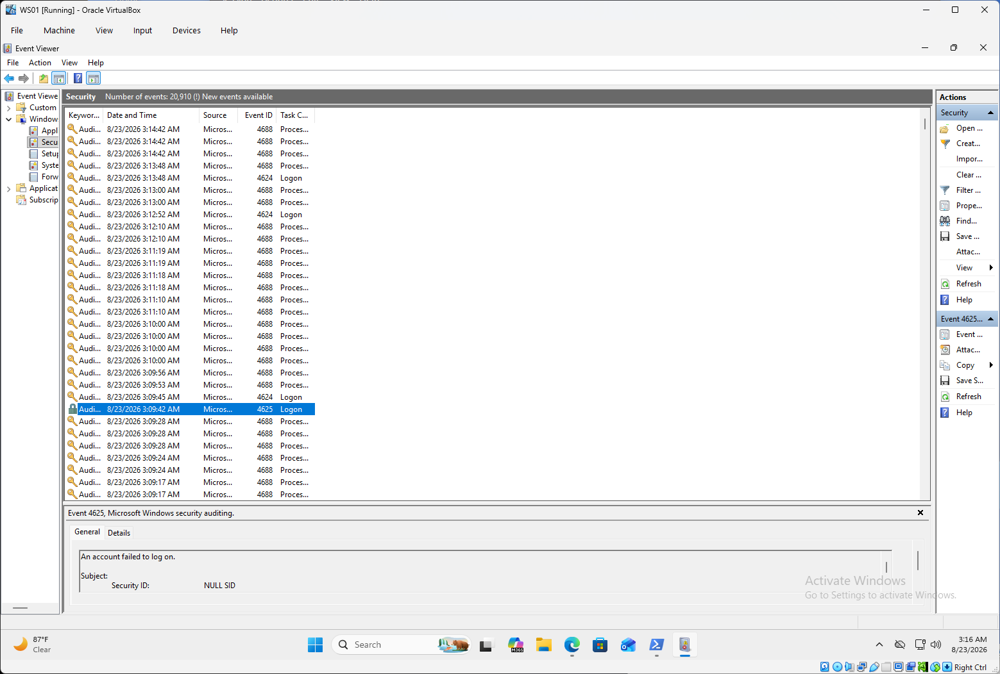

*Windows Security Event 4625 generated by a failed SMB authentication attempt from the Kali Linux VM.*

#### Successful Authentication

I then authenticated using the correct lab credentials. Windows recorded the successful network authentication as Event ID **4624** with Logon Type **3**.

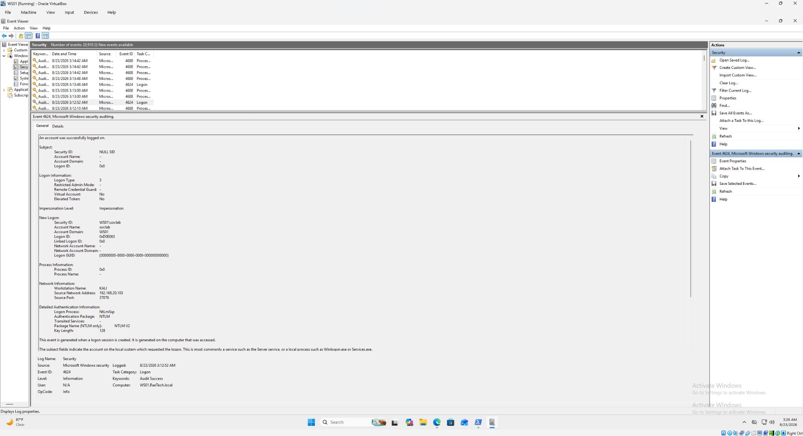

*Windows Security Event 4624 showing a successful network logon from the Kali Linux VM.*

#### Network Share Access

Windows also generated Event ID **5140**, providing evidence that a network share was accessed over SMB.

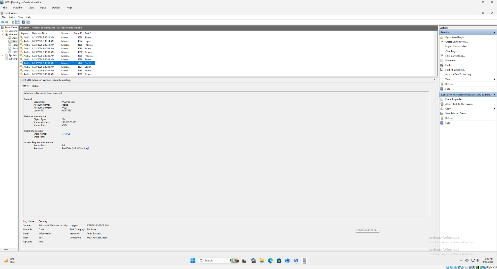

*Windows Event ID 5140 showing network share access associated with the SMB activity.*

This scenario demonstrated how activity originating from a separate machine can be traced using the source IP, account, authentication result, logon type, and Windows Security events.

**MITRE ATT&CK:** T1021.002 - SMB/Windows Admin Shares

## Troubleshooting & Lessons Learned

This lab did not work perfectly on the first attempt. Several parts required troubleshooting, which helped me understand how the environment worked instead of only following setup steps.

### Sentinel Navigation and Rule Management

Some Microsoft Sentinel options redirected between the Azure portal and Microsoft Defender portal, which made certain analytics and connector settings difficult to manage through the interface.

I worked around this by using Azure Cloud Shell and the Sentinel REST API/CLI to create, update, verify, and close incidents and analytics rules.

### Telemetry Collection Gaps

During the Nmap network reconnaissance test, Windows generated Security Event ID 5152 locally, but the events did not initially appear in Sentinel.

I found that the Azure Data Collection Rule was only collecting Event IDs 4624, 4625, and 4688. I updated the DCR to include Event ID 5152 and verified that the new events were successfully ingested into the `SecurityEvent` table.

This reinforced that an event existing on an endpoint does not automatically mean the SIEM is collecting it.

### Detection Rule Noise

The account discovery detection initially created multiple incidents for the same activity because the rule used a 15-minute lookback while running every 5 minutes.

The same events were being evaluated more than once. I enabled a 15-minute suppression period to reduce duplicate incidents while keeping the longer query window.

This showed me that detection engineering is not only about identifying suspicious activity. A useful rule also needs to control unnecessary alert noise.

### VirtualBox Bridged Networking

The Kali Linux VM occasionally stopped receiving an IPv4 address even though its virtual network adapter was enabled.

I traced the problem to the VirtualBox bridged networking driver on the Windows host. Resetting the VirtualBox NDIS6 bridge binding restored DHCP connectivity and allowed Kali to reconnect to the lab network.

### Investigation Context

Several activities in this lab were intentionally suspicious, including failed logons, account discovery commands, PowerShell activity, remote SMB authentication, and network scanning.

The alerts themselves did not prove that the systems were compromised. I had to review the user, host, source IP, timestamps, authentication activity, process relationships, and surrounding events before deciding how each incident should be classified.

One of the biggest lessons from the lab was that a detection can be technically correct even when the final incident is determined to be authorized or benign.

## Key Takeaways

This project helped me understand how the different parts of a SOC environment connect instead of viewing them as separate tools.

Some of my main takeaways were:

- **Telemetry comes before detection.** Before creating a rule, I had to confirm that Windows generated the event and that the event was actually reaching Microsoft Sentinel.

- **KQL turns raw logs into useful evidence.** I used KQL to filter authentication and process events, build timelines, identify suspicious patterns, and create detection logic.

- **An alert is not proof of compromise.** Each incident required additional investigation before I could determine whether the activity was malicious, suspicious, or expected.

- **Process and authentication context matter.** Parent/child process relationships, usernames, source IP addresses, logon types, timestamps, and surrounding activity helped explain what actually happened.

- **Detection rules require tuning.** A rule can successfully detect suspicious behavior while still producing unnecessary duplicate alerts. Adjusting lookback periods and suppression helped reduce noise.

- **MITRE ATT&CK provides context for detections.** Mapping activity to ATT&CK techniques helped me understand how behaviors such as account discovery and network service scanning fit into common attacker workflows.

- **Data collection has to be verified.** During the network scanning test, Event ID 5152 existed locally but was not initially being collected by Sentinel. Updating the Data Collection Rule fixed the visibility gap.

- **The full investigation workflow matters more than simply generating alerts.** The most valuable part of the lab was following activity from the endpoint, through telemetry and detection, into a Sentinel incident that I could investigate and classify.

## Conclusion

This project gave me hands-on experience building and working through a small SOC environment from the ground up.

I configured a domain-based Windows lab, collected endpoint telemetry, sent security events into Microsoft Sentinel, wrote KQL queries, created custom analytics rules, generated controlled attack activity from Kali Linux, and investigated the resulting incidents.

The biggest thing I gained from this project was a better understanding of how all of those pieces connect. An attack does not automatically become an alert. The endpoint has to generate useful telemetry, that telemetry has to reach the SIEM, the detection logic has to recognize a suspicious pattern, and the analyst still has to investigate the context before deciding what actually happened.

The lab also showed me that detection engineering involves more than simply making a rule fire. I had to troubleshoot missing telemetry, adjust data collection, tune noisy detections, review process and authentication activity, and verify my conclusions with evidence.

This was completed as a hands-on home lab for learning and portfolio development. It gave me practical experience with the type of investigation and detection workflow I would expect to continue developing in an entry-level SOC Analyst role.
